# Random Walk Crawl Architecture

This document describes the random walk crawling process used by the distributed Telegram crawler. Two modes are supported:

- **Standard mode** — the crawler validates discovered channels itself via TDLib `SearchPublicChat` RPCs
- **Tandem mode** (`--tandem-crawl`) — the crawler writes discovered edges to a `pending_edges` table; a separate validator pod validates them via HTTP (`t.me/<username>`) to avoid account-level Telegram rate limits

Both modes share the same core loop (`RunRandomWalkLayerless`), page buffer, edge recording, and walkback logic. They diverge at the point where discovered outlinks are validated and the next page is selected.

---

## 1. System Overview

The highest level of abstraction — how the major components interact.

### 1.1 Standard Mode

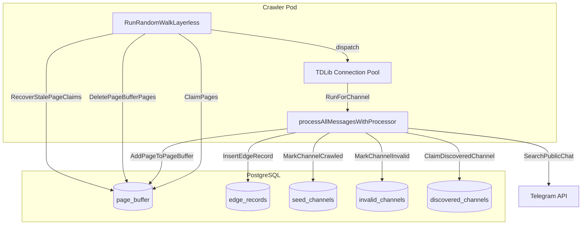

### 1.2 Tandem Mode

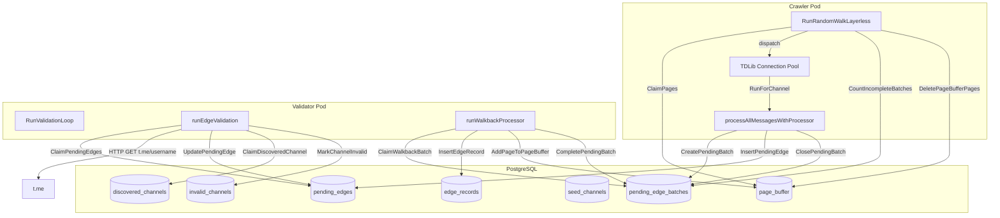

---

## 2. Core Loop — RunRandomWalkLayerless

This is the engine shared by both modes. It runs in `dapr/standalone.go` (line 888).

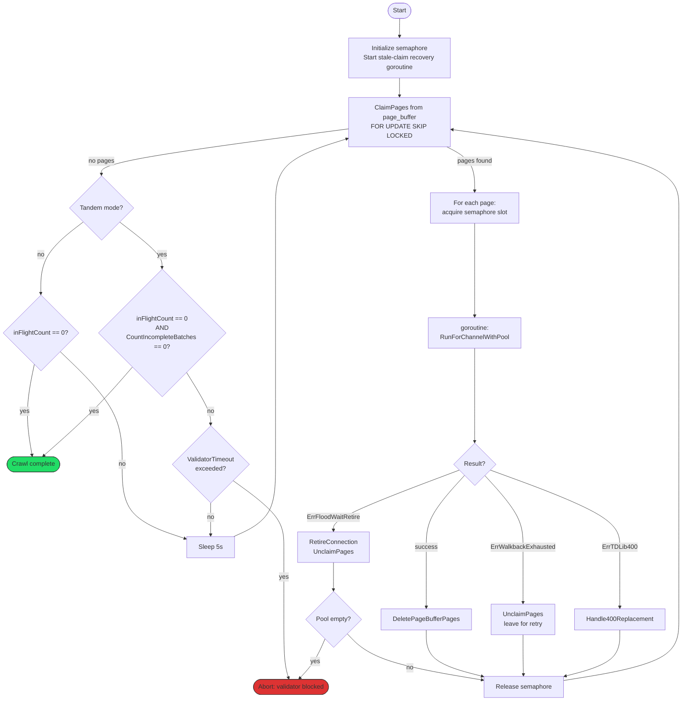

### Key design decisions

- **Semaphore concurrency**: Each worker holds a semaphore slot, not a batch-barrier. Pages are deleted immediately per-worker — no convoy effect.
- **Stale claim recovery**: A background goroutine runs `RecoverStalePageClaims()` every 5 minutes, releasing pages claimed by crashed pods.
- **Tandem completion**: The crawler only exits when both `inFlightCount == 0` (all workers done) AND `CountIncompleteBatches == 0` (validator finished all batches).

---

## 3. Channel Processing — RunForChannel

Runs per-page inside a worker goroutine. Acquires a TDLib connection from the pool, fetches messages, extracts outlinks.

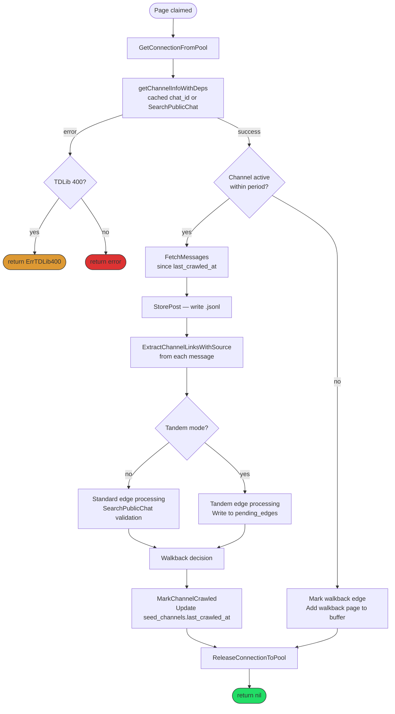

---

## 4. Edge Processing — Standard Mode

When `--tandem-crawl` is NOT set. The crawler validates outlinks itself via TDLib.

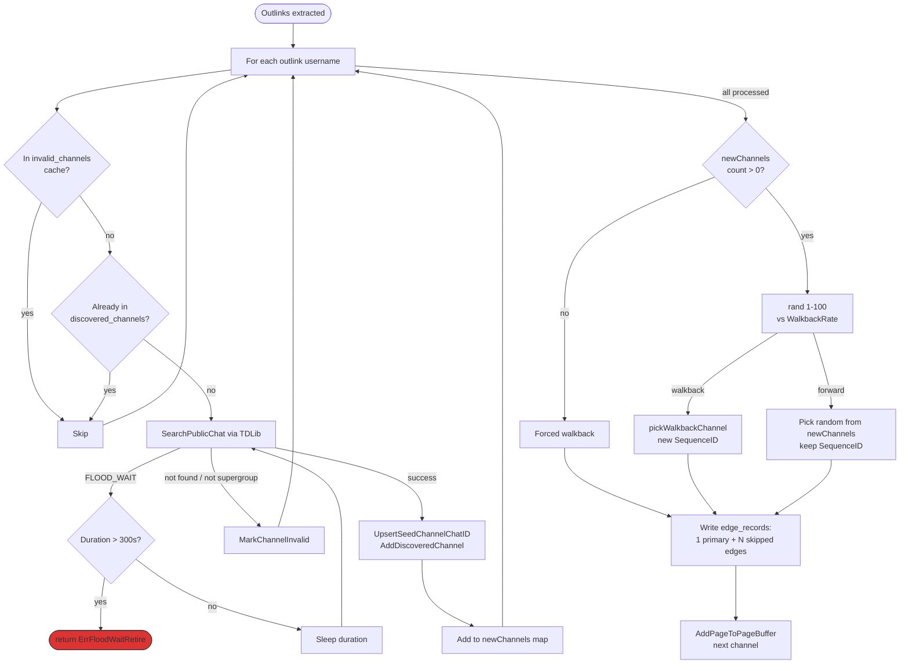

### Edge record fields

| Field | Forward walk | Walkback | Skipped |
|-------|-------------|----------|---------|
| `walkback` | false | true | false |
| `skipped` | false | false | true |
| `sequence_id` | parent's | parent's | parent's |

The **next page** inherits the parent's `sequence_id` on forward walk, or gets a **new UUID** on walkback (breaking the chain).

---

## 5. Edge Processing — Tandem Mode

When `--tandem-crawl` IS set. The crawler writes raw outlinks; a separate validator pod processes them.

### 5.1 Crawler side

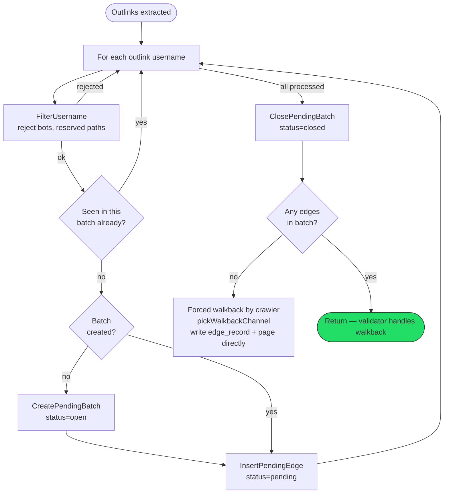

### 5.2 Validator side — Edge Validation

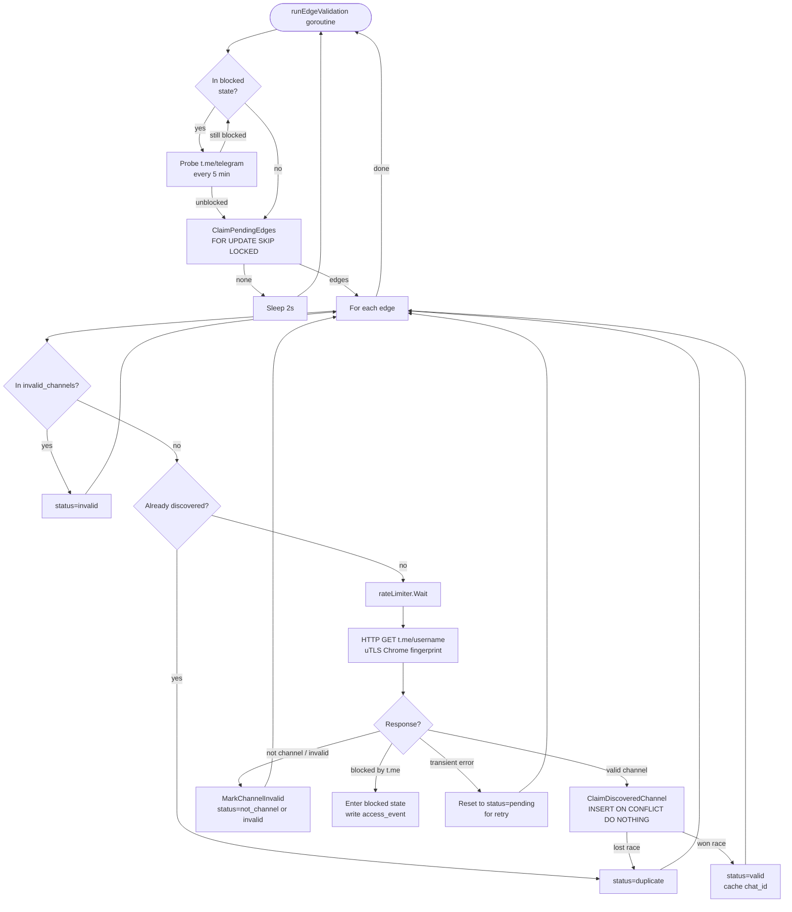

### 5.3 Validator side — Walkback Processing

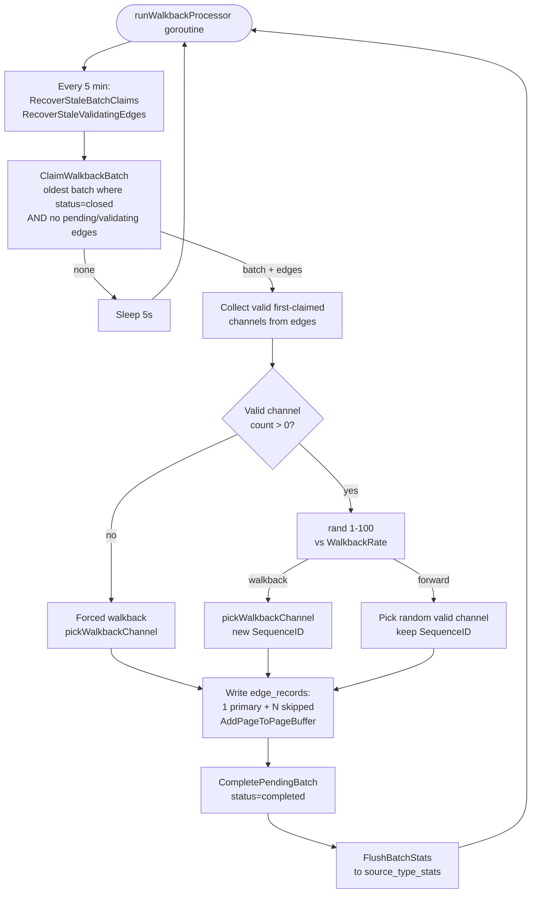

---

## 6. Walkback Decision Logic

The walkback mechanism prevents the walk from getting stuck in dense clusters by periodically jumping to a previously-seen channel.

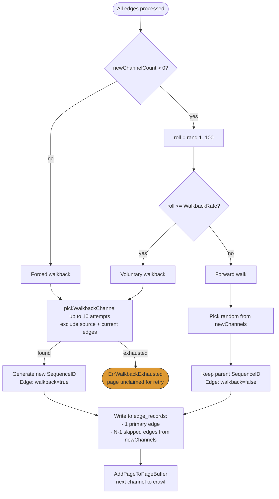

### Sequence chain example

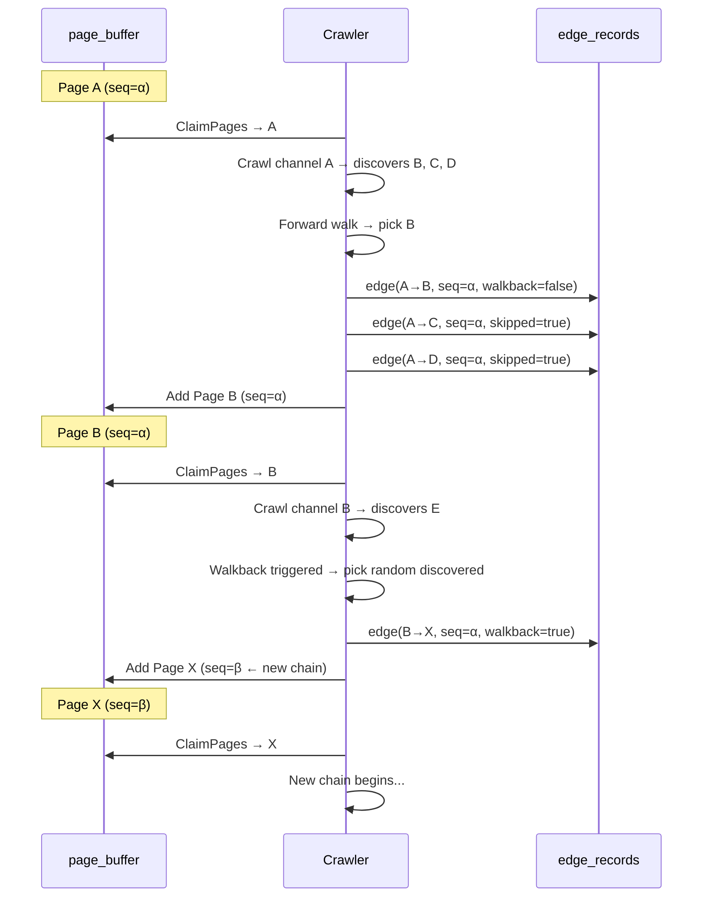

---

## 7. Error Handling & Recovery

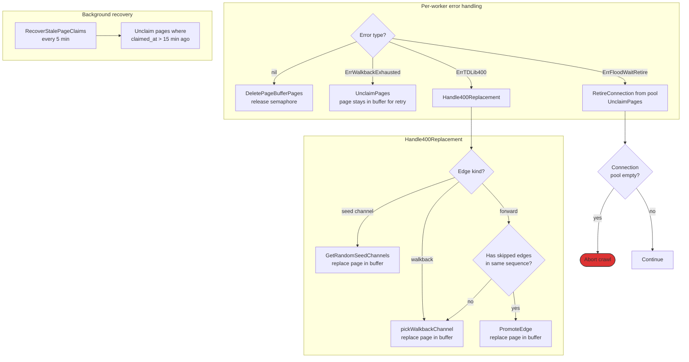

---

## 8. Database Schema Relationships

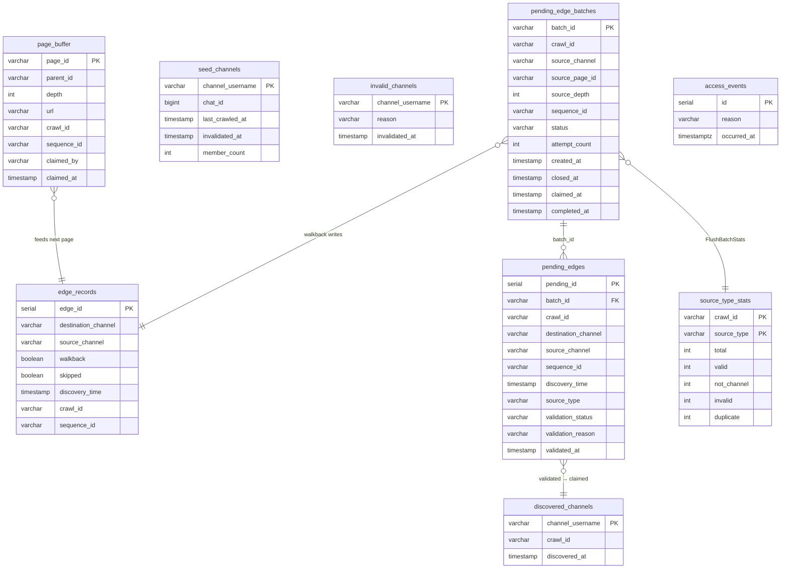

---

## 9. Multi-Pod Concurrency

Multiple crawler pods share the same `page_buffer` and `crawl_id`. Isolation is achieved via PostgreSQL row-level locking.

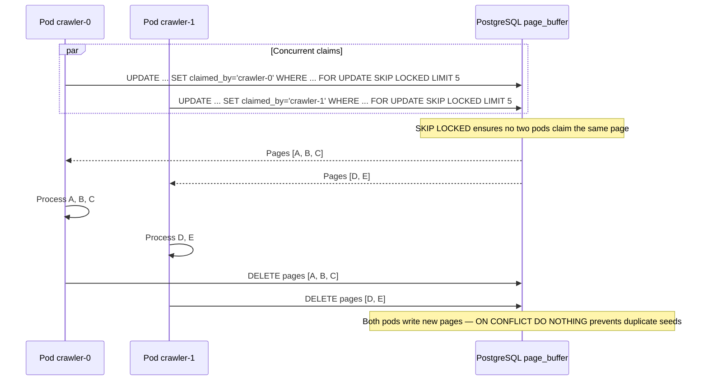

---

## Appendix: Configuration Flags

| Flag | Default | Mode | Purpose |
|------|---------|------|---------|
| `--sampling-method random-walk` | — | both | Enables random walk mode |
| `--tandem-crawl` | false | tandem | Write to pending_edges instead of SearchPublicChat |
| `--validate-only` | false | validator | Run as validator pod only |
| `--walkback-rate` | 20 | both | Percentage chance of voluntary walkback (1-100) |
| `--concurrency` | 1 | both | Number of parallel workers / TDLib connections |
| `--validator-request-rate` | 6 | validator | HTTP calls per minute |
| `--validator-claim-batch-size` | 10 | validator | Edges claimed per DB round-trip |
| `--validator-timeout` | 0 | tandem | Abort if validator blocked for this duration (0=disabled) |
| `--exit-on-complete` | false | both | Exit pod when crawl finishes |
